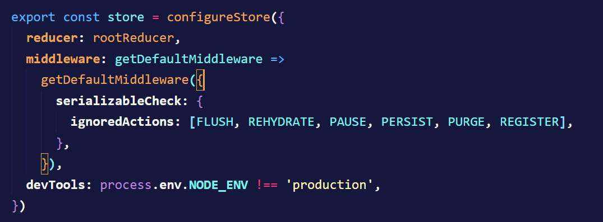

# Persist steps

# 1 - Install persist

- [] - npm i redux-persist

# 2 - Copy from docs to store.js

- [] - https://redux-toolkit.js.org/usage/usage-guide#use-with-redux-persist

- [] - Скопіювати другий і третій імпорти в store.js

`import {
  persistStore,
  persistReducer,
  FLUSH,
  REHYDRATE,
  PAUSE,
  PERSIST,
  PURGE,
  REGISTER,
  } from 'redux-persist'
  import storage from 'redux-persist/lib/storage'
 `

- [] - Копіювати конфіг для персісту

`const persistConfig = {
key: 'root',
version: 1,
storage,
}`

- [] - Копіюємо функцію "persistReducer" для створення персіст редьюсера
  ` const persistedReducer = persistReducer(persistConfig, todoReducer)`

- [] - Перший аргумент - це сам конфіг, де може бути налаштування чорних та білих списків
- [] - Другий аргумент - це редьюсер, котрий ми хочемо записати в локал сторедж

-[] - Копіювати мідлвейр нижче редьюсера в сторі

`middleware: getDefaultMiddleware =>
		getDefaultMiddleware({
			serializableCheck: {
				ignoredActions: [FLUSH, REHYDRATE, PAUSE, PERSIST, PURGE, REGISTER],
			},
		}),`

- [] - Експортувати персістор назовні
  `export const persistor = persistStore(store)`

- [] - Перейти до index.js та огорнути наш App
  `<PersistGate loading={null} persistor={persistor}>
    <App />
</PersistGate>`
